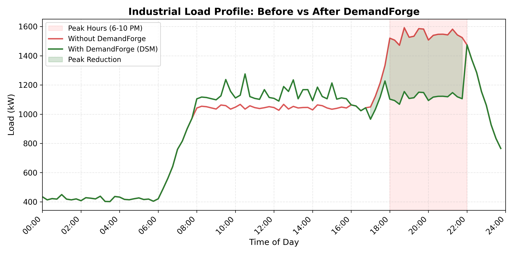
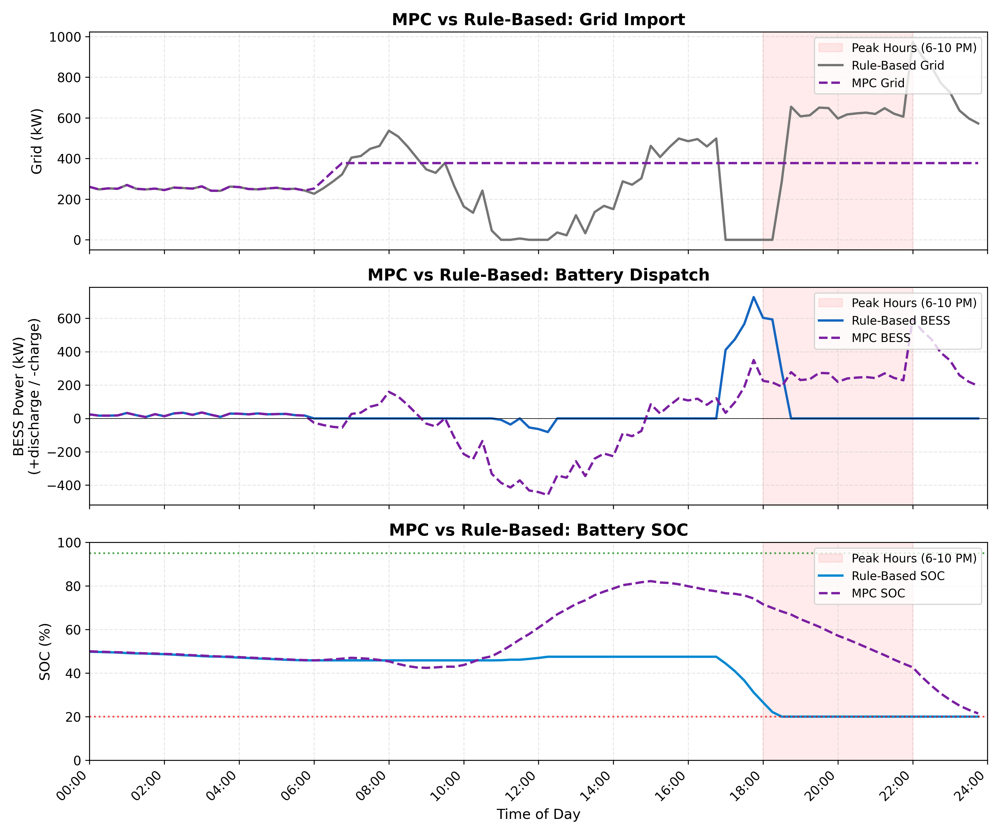

# DemandForge

**A simulation of a hybrid renewable energy system for evening peak-demand relief in Indian manufacturing clusters.**

Built by Team CityCoders for **Hybrid Hack 2026**, organised by Aaruush, SRM Institute of Science and Technology, Chennai (22 June – 10 July 2026). **1st place.**

Indian manufacturing clusters pay twice for evening demand: a time-of-day surcharge on energy between 6 and 10 PM, and a monthly demand charge levied on the highest kVA drawn at any point in the billing cycle. DemandForge models whether a solar + waste-heat + battery system can cut both, and whether the economics work without a subsidy.

It answers that with a 24-hour dispatch simulation at 15-minute resolution, three dispatch strategies compared against a grid-only baseline, an XGBoost demand forecaster trained on a synthetic 30-day dataset, and an LCOS/IRR economic model.

---

## Results

Modelled site: 1.0 MWp solar PV, 500 kW ORC waste-heat recovery, 3.5 MWh battery (2,625 kWh usable), 1.5 MW inverter, ₹7.65/kWh base tariff with a 25% peak surcharge and a ₹475/kVA/month demand charge.

| Metric | Result |
|---|---|
| Peak-hour grid reduction (6–10 PM) | 65.9% |
| Overall 24h grid energy reduction | 64.6% |
| Peak demand reduction (kW) | 38.8% |
| Renewable energy fraction | 61.1% |
| Daily cost saving | 61.2% |
| LCOS | ₹6.01/kWh (vs ₹7.65 grid) |
| IRR | 27.9% |
| Payback | 4 years |

Forecasting accuracy on held-out data:

| Model | Target | MAPE | R² |
|---|---|---|---|
| XGBoost | Electrical demand | 2.7% | 0.9945 |
| XGBoost | Furnace thermal load | 3.6% | 0.9920 |
| SMA baseline | Electrical demand | 1.3% | — |

> **Caveat, stated plainly:** the 30-day dataset is synthetic, generated from modelled load, solar and furnace-thermal profiles rather than metered from a real plant. The forecasting scores above are therefore a check that the pipeline works, not evidence of real-world accuracy — a model will always fit generated data well. The dispatch and economic results should be read as a feasibility study under stated assumptions, not as measured savings.




---

## How it works

Nine stages, orchestrated by `src/main.py`:

1. **Synthetic data generation** (`synthetic_data.py`) — 30 days at 15-minute resolution, with weekday/weekend variation, of electrical demand, furnace thermal output, ORC electrical output and solar generation.
2. **XGBoost co-forecasting** (`xgboost_forecast.py`) — predicts electrical and thermal load jointly, since ORC output is downstream of furnace heat.
3. **Demand-side management** (`models.py`) — motor staggering and thermal pre-loading, applied before dispatch.
4. **Baseline simulation** — grid-only, for comparison.
5. **Rule-based dispatch** (`simulation.py`) — charge on surplus, discharge into peak.
6. **MPC dispatch** (`mpc_optimizer.py`) — a linear program over all 96 steps, solved with PuLP/CBC, minimising energy cost + demand charge + battery degradation subject to SOC, inverter and grid-cap constraints.
7. **SMA/WMA forecasting** (`forecasting.py`) — classical baselines to benchmark XGBoost against.
8. **LCOS analysis** (`lcos.py`) — levelised cost of storage, IRR, payback.
9. **Charts** (`charts.py`) — 14 figures.

All system parameters live in `src/config.py`. Change the tariff, battery size or grid cap there and rerun.

## Running it

```bash
pip install -r requirements.txt
cd src && python main.py
```

Roughly a minute on a laptop. Writes `charts/` and `results/`.

**Note:** MPC dispatch requires PuLP. Without it the optimiser returns an empty frame and the pipeline continues silently with rule-based results only — so install the full requirements file, not just the scientific stack.

## Repository layout

```
src/          simulation, forecasting, optimisation, charting
charts/       14 generated figures
docs/         final-round pitch deck
```

## What I'd do differently

- **Validate against a real plant.** Everything here rests on synthetic data. One month of metered 15-minute data from an actual furnace-equipped facility would either confirm or destroy the load model, and nothing else matters as much.
- **Fail loudly on the missing solver.** The MPC step degrading silently to "no results" is exactly the kind of bug that makes a demo look fine while the headline feature is switched off.
- **Model degradation properly.** Battery degradation is a flat per-kWh cost here; a real analysis would make it depend on depth of discharge and cycle rate.
- **Test the tariff assumptions per state.** ToD structures and demand charges vary considerably across state electricity boards, and the payback figure is sensitive to both.

## Licence

MIT — see `LICENSE`.
